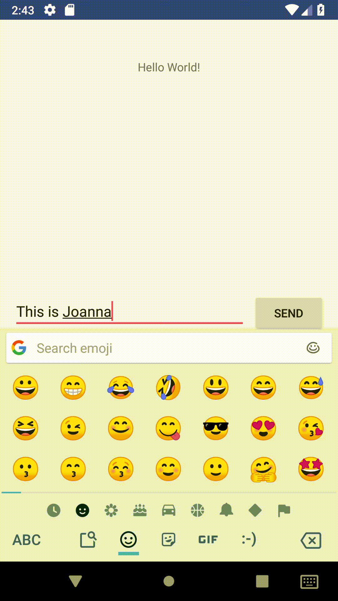

# Assignment 1: Android Studio & Github Basics

This is Assignment 1 for CSCI 3130 Summer 2018. 

Original code forked from [jmfranz/CSCI3130-Demo](https://github.com/jmfranz/CSCI3130-Demo), modified as necessary to complete the assignment.

Most of the modifications were completed upon viewing the tutorial under the [Android Developer documentation](https://developer.android.com/training/basics/firstapp/), where again, modifications were made as necessary to complete the assignment.
